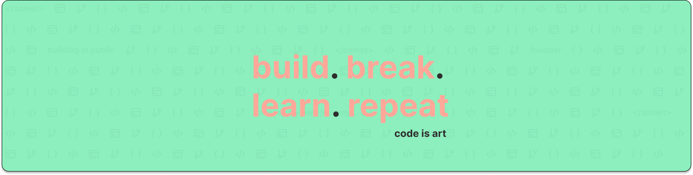

# Hey, I'm Raj 👋
**🌱 I’m currently working on** Full-stack web apps with **React ⚛️ + Node.js ⚡**  

**🤝 I’m looking to collaborate on** Open-source & real-world web projects 🚀  

**🙋 I’m looking for help with** Growing in **open-source contributions** & scaling projects 🌍  

**📚 I’m currently learning** Modern **React**, API integrations & web performance 🏎️  

**💬 Ask me about** My projects, my career shift from **Electrical ⚡ → Web Dev 💻**, or why **Flexbox = superhero 🦸**  

**🎉 Fun fact** I code in JavaScript, but I also speak **English, Hindi, and Odia** fluently 🌐 (And yes, coffee ☕ makes my debugging skills 10x faster 😉)

## 🌐 Socials:
       

# 💻 Tech Stack:
                     
# 📊 GitHub Stats:
 

### ✍️ Random Dev Quote

<!-- Proudly created with GPRM ( https://gprm.itsvg.in ) -->
